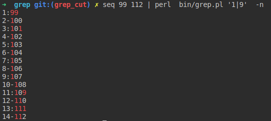

## Реализовать утилиту фильтрации (`man grep`)

Поддержать флаги:

* `-A` - "after" печатать +N строк после совпадения
* `-B` - "before" печатать +N строк до совпадения
* `-C` - "context" (A+B) печатать ±N строк вокруг совпадения
* `-c` - "count" (количество строк)
* `-i` - "ignore-case" (игнорировать регистр)
* `-v` - "invert" (вместо совпадения, исключать)
* `-F` - "fixed", точное совпадение со строкой, не паттерн
* `-n` - "line num", печатать номер строки.

> Подразумеваем, что паттерн перловый, (аналог `grep -P`)
> См. `man grep` (linux) [linux.die.net/man/1/grep](https://linux.die.net/man/1/grep)

### Пример:

```sh
$ seq 1 30 | perl grep.pl '\d7'
17
27
$ seq 1 30 | perl grep.pl -B1 '17'
16
17
$ seq 1 30 | perl grep.pl -A1 '17'
17
18
$ seq 15 20 | perl grep.pl -v '\d[6-8]'
15
19
20
```

## Дополнительное задание:

* Если активен флажок `-n`, для четных строк разделителем между номером строки и самой строкой будет ":". Для нечетных -- "-".
```bash
seq 1 5 | perl  bin/grep.pl '.*' -n
1:1
2-2
3:3
4-4
5:5
```
* Реализовать подсветку подстрок, которые сматчились. Например, так:


[Подсказочка](https://perldoc.perl.org/Term/ANSIColor.html)